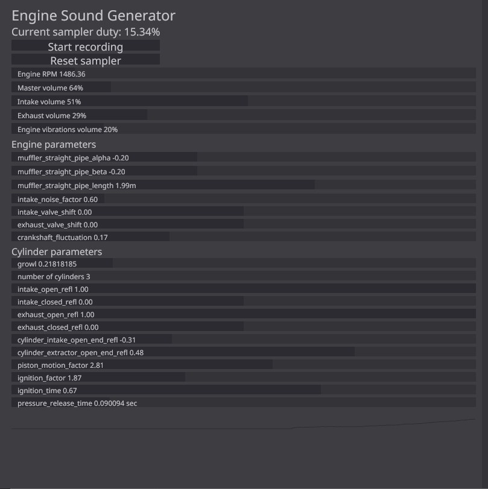

# enginesound


GUI Application used to generate purely synthetic engine sounds with advanced options written in Rust

loosely based on [this paper](https://www.researchgate.net/publication/280086598_Physically_informed_car_engine_sound_synthesis_for_virtual_and_augmented_environments "Physically informed_car engine sound synthesis for virtual and augmented environments")

#### Reading the paper is highly suggested to understand the parameters ####

## Features ##


#### General ####
```
 - Variable engine parameters
 - 48khz mono WAV recording
 - RON SerDe of engine parameters
 - SIMD accelerated low pass filtering with simdeez
 - Pseudorealistic acoustic pipe/chamber simulation (speed of sound, end reflection)
   based on the above paper
 - Advanced clap-rs powered CLI
 - Intake, Exhaust and Engine vibrations mixing
```

#### GUI Application specific ####
```
 - GUI made with conrod/glium
 - Real-time preview of parameters with SDL2 audio
 - Real-time interactive parameter sliders with small descriptions
 - Record/Stop button
 - Filebrowser to select RON files containing serialized parameters to load with the Load button
 - Save button to save the current parameters into a timestamped file in the current working directory
 - Reset sampler button to kill resonances in all acoustic chambers
```

#### CLI specific ####
```
 - headless mode which does not start audio streaming or a GUI
 - config argument to specify the file containing RON-serialized parameters
 - volume/rpm/length arguments to control master volume/engine rpm/recording length
 - crossfade argument which cuts the recording in half, swaps the halves and
   fades the middle for x seconds (reduces output length by x/2 seconds), used to make seamless loops
 - warmup time argument to wait for the resonances in the acoustic chambers to be
   established before recording
```

## Building ##

libSDL2 (and -devel) packages will need to be installed:
[Instructions on how to build with Rust-SDL2](https://github.com/Rust-SDL2/rust-sdl2/blob/master/README.md#requirements)

## Preview ##
### GUI ###


### Sound ###
Generated using the config shown above while adjusting the RPM manually: [Audio file](https://raw.githubusercontent.com/DasEtwas/enginesound/master/example_ff0d902.mp3)

## Packaging ##
### Windows ###
Just be sure that SDL2.dll is next to the .exe

### Linux ###
SDL2 will need to be installed to run

## Licensing ##

MIT License
