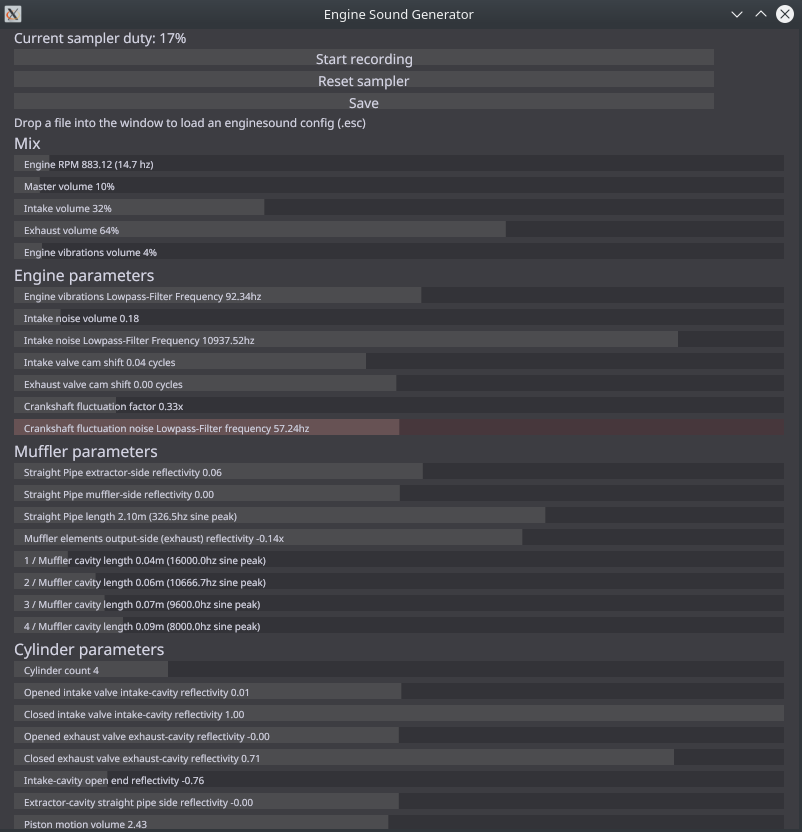

# enginesound

GUI Application used to generate purely synthetic engine sounds with advanced options written in Rust

loosely based on [this paper](https://www.researchgate.net/publication/280086598_Physically_informed_car_engine_sound_synthesis_for_virtual_and_augmented_environments "Physically informed_car engine sound synthesis for virtual and augmented environments")

#### Reading the paper is highly recommended to understand the parameters ####

## Features ##


#### General ####
```
 - Variable engine parameters
 - 48khz mono WAV recording
 - RON SerDe of engine parameters
 - SIMD accelerated low pass filtering with simdeez
 - Pseudorealistic acoustic pipe/chamber simulation (speed of sound, end reflection)
   based on the above paper
 - Advanced clap-rs powered CLI
 - Intake, Exhaust and Engine vibrations mixing
```

#### GUI specific ####
```
 - GUI made with conrod/glium
 - Real-time preview of parameters with SDL2 audio
 - Real-time interactive parameter sliders with small descriptions
 - Record/Stop button
 - Dropping a config into the window loads the config
 - Save button to save the current parameters into a timestamped file in the current working directory
 - Reset sampler button to kill resonances in all acoustic chambers
```

#### CLI specific ####
```
 - headless mode which does not start audio streaming or a GUI
 - config argument to specify the file containing RON-serialized parameters
 - volume/rpm/length arguments to control master volume/engine rpm/recording length
 - crossfade argument which cuts the recording in half, swaps the halves and
   fades the middle for x seconds (reduces output length by x/2 seconds), used to make seamless loops
 - warmup time argument to wait for the resonances in the acoustic chambers to be
   established before recording
```

## Building ##

libSDL2 (and -devel) packages will need to be installed:
[Instructions on how to build with Rust-SDL2](https://github.com/Rust-SDL2/rust-sdl2/blob/master/README.md#requirements)

#### Windows MinGW ####
The folder [win_sdl_libs](win_sdl_libs) contains a script which should help fix linking errors, but it does copy a
few files to the default toolchain.

## Preview ##
### CLI ###
```
Engine Sound Generator 1.3.0
https://github.com/DasEtwas/
GUI Application used to generate purely synthetic engine sounds with advanced options in real-time, written in Rust.
It features real-time recording of the engine, a CLI, automatic crossfading to create seamless loops in the CLI,
realtime frequency domain display through FFT, and preset saving/loading capabilities.

USAGE:
    enginesound [FLAGS] [OPTIONS]

FLAGS:
        --help        Prints help information
    -h, --headless    CLI mode without GUI or audio playback
    -V, --version     Prints version information

OPTIONS:
    -c, --config <config>              Sets the input file to load as an engine config
    -f, --crossfade <crossfade>        Crossfades the recording in the middle end-to-start to create a seamless loop,
                                       although adjusting the recording's length to the rpm is recommended. The value
                                       sets the size of the crossfade, where the final output is decreased in length by
                                       crossfade_time/2.
    -o, --output <output_file>         Sets the output .wav file path
    -l, --length <reclen>              Sets the time to record in seconds. The formula for the recommended time to
                                       record to get a seamless loop is as follows:
                                       let wavelength = 120.0 / rpm;
                                       let crossfade = wavelength * 2.0;
                                       let reclen = audio_length + crossfade / 2.0;
    -r, --rpm <rpm>                    Engine RPM
    -q, --samplerate <samplerate>      Generator sample rate [default: 48000]
    -v, --volume <volume>              Sets the master volume [default: 0.1]
    -w, --warmup_time <warmup_time>    Sets the time to wait in seconds before recording
```

### GUI ###


### Sound ###
Generated using the config shown above while adjusting the RPM manually: [Audio file](example.mp3)

## Packaging ##
### Windows ###
Just be sure that SDL2.dll is next to the .exe

### Linux ###
SDL2 will need to be installed to run

## Licensing ##

MIT License
